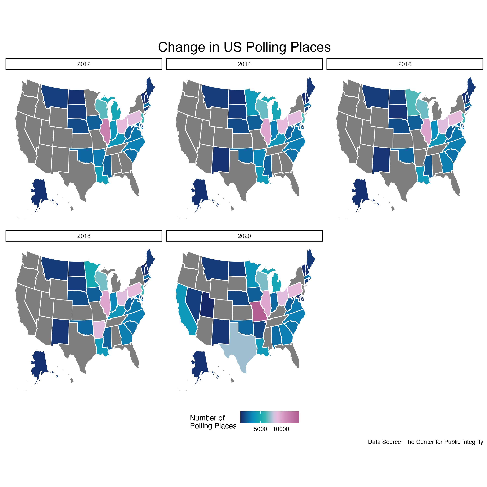
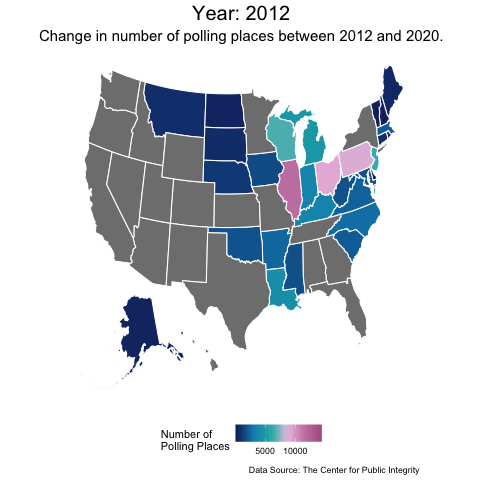

# US Polling Places

## The change in the number of polling places in the United States between 2012 and 2020.

Grey indicates data is missing for that state.

## Animated Version

Grey indicates data is missing for that state.
